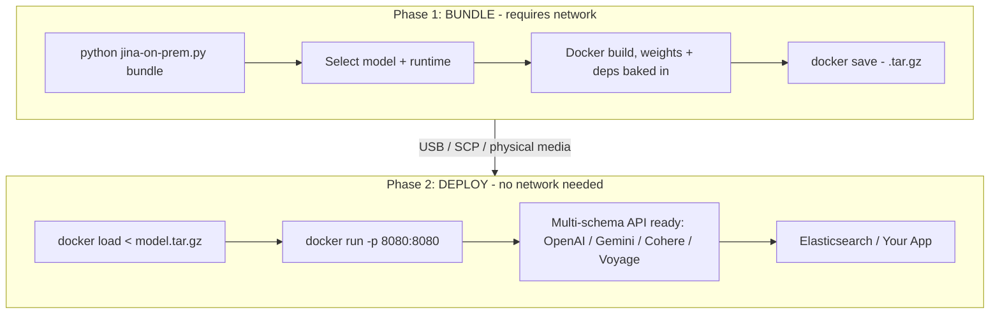

# jina-on-prem

On-prem deployment toolkit for Jina AI models. Bundle embedding, reranker, and reader models into self-contained Docker images that run fully offline.

> **New here?** The [Quick Start wiki page](https://github.com/jina-ai/jina-on-prem/wiki/Quick-Start) gets you to your first `/v1/embeddings` response in 5 minutes using a prebuilt image. Full tutorials, troubleshooting, and the model catalog live in the [wiki](https://github.com/jina-ai/jina-on-prem/wiki).




## Quick start

### Already have a prebuilt? Skip bundling

```bash
./scripts/pull-prebuilt.sh jina-embeddings-v5-text-nano cpu
# produces jina-embeddings-v5-text-nano-cpu.tar.gz
# transfer it, then on the offline machine:
docker load < jina-embeddings-v5-text-nano-cpu.tar.gz
docker run -p 8080:8080 jina/jina-embeddings-v5-text-nano:cpu
```

> **On a Mac (Apple Silicon)?** Prebuilt images are `linux/amd64` only, so a plain `docker pull` fails with `no matching manifest for linux/arm64/v8`. `pull-prebuilt.sh` handles this for you, falling back to `linux/amd64` only when the registry has nothing for your architecture; if you pull by hand, add the flag to both commands: `docker pull --platform linux/amd64 ...` and `docker run --platform linux/amd64 ...`. It then runs under Rosetta emulation, correct but slow - fine for a first look, not for a benchmark. To develop against the API on a Mac, skip Docker and run the server directly: `python jina-on-prem.py serve` uses native arm64 PyTorch.

### Bundle from scratch

```bash
python jina-on-prem.py list                                       # show all models
python jina-on-prem.py bundle                                     # interactive picker
python jina-on-prem.py bundle --model jina-embeddings-v5-text-nano --cpu-only --yes
```

Need a builder machine? [`scripts/bootstrap-gcp.sh`](scripts/bootstrap-gcp.sh) provisions one on GCP with Docker + NVIDIA Container Toolkit + the repo pre-cloned.

### Deploy (air-gapped machine)

No repo, no scripts, no Python. Just Docker.

```bash
docker load < MODEL.tar.gz
docker run -p 8080:8080 jina/MODEL:cpu                           # CPU
docker run --gpus all -p 8080:8080 jina/MODEL:gpu                # GPU
curl http://localhost:8080/health
```

Or via docker compose:

```bash
MODEL=jina-embeddings-v5-text-nano RUNTIME=cpu docker compose up -d
# for embed + rerank side-by-side:
docker compose -f docker-compose.multi.yml up -d
```

### Python client

```bash
uv pip install openai requests
python examples/python_client.py
```

Drops in via OpenAI SDK with `base_url="http://your-host:8080/v1"`.

## Models

29 models supported: embeddings (v5, v4, v3, v2), rerankers, readers, ColBERT, CLIP, VLM. 28 of them have prebuilt images; every model can be bundled from source. Headline picks:

| Model | Type | Modality | Params | VRAM | Prebuilt |
|---|---|---|---|---|---|
| `jina-embeddings-v5-text-nano` | embedding | text | 239M | ~2GB | [cpu](https://github.com/orgs/jina-ai/packages/container/package/jina-on-prem%2Fjina-embeddings-v5-text-nano) / [gpu](https://github.com/orgs/jina-ai/packages/container/package/jina-on-prem%2Fjina-embeddings-v5-text-nano) |
| `jina-embeddings-v5-text-small` | embedding | text | 677M | ~3GB | [cpu](https://github.com/orgs/jina-ai/packages/container/package/jina-on-prem%2Fjina-embeddings-v5-text-small) / [gpu](https://github.com/orgs/jina-ai/packages/container/package/jina-on-prem%2Fjina-embeddings-v5-text-small) |
| `jina-embeddings-v3` | embedding | text | 570M | ~3GB | [cpu](https://github.com/orgs/jina-ai/packages/container/package/jina-on-prem%2Fjina-embeddings-v3) / [gpu](https://github.com/orgs/jina-ai/packages/container/package/jina-on-prem%2Fjina-embeddings-v3) |
| `jina-embeddings-v5-omni-nano` | embedding | multimodal | 1.04B | ~5GB | [cpu](https://github.com/orgs/jina-ai/packages/container/package/jina-on-prem%2Fjina-embeddings-v5-omni-nano) / [gpu](https://github.com/orgs/jina-ai/packages/container/package/jina-on-prem%2Fjina-embeddings-v5-omni-nano) |
| `jina-embeddings-v5-omni-small` | embedding | multimodal | 1.74B | ~8GB | [cpu](https://github.com/orgs/jina-ai/packages/container/package/jina-on-prem%2Fjina-embeddings-v5-omni-small) / [gpu](https://github.com/orgs/jina-ai/packages/container/package/jina-on-prem%2Fjina-embeddings-v5-omni-small) |
| `jina-clip-v2` | embedding | multimodal | 865M | ~4GB | [cpu](https://github.com/orgs/jina-ai/packages/container/package/jina-on-prem%2Fjina-clip-v2) / [gpu](https://github.com/orgs/jina-ai/packages/container/package/jina-on-prem%2Fjina-clip-v2) |
| `jina-reranker-v3.5` | reranker | text | 0.6B | ~3GB | [cpu](https://github.com/orgs/jina-ai/packages/container/package/jina-on-prem%2Fjina-reranker-v3.5) / [gpu](https://github.com/orgs/jina-ai/packages/container/package/jina-on-prem%2Fjina-reranker-v3.5) |
| `jina-reranker-v3` | reranker | text | 597M | ~3GB | [cpu](https://github.com/orgs/jina-ai/packages/container/package/jina-on-prem%2Fjina-reranker-v3) / [gpu](https://github.com/orgs/jina-ai/packages/container/package/jina-on-prem%2Fjina-reranker-v3) |

Full catalog with all 29 models, VRAM, context windows, and licenses: [Model Catalog wiki](https://github.com/jina-ai/jina-on-prem/wiki/Model-Catalog) (auto-generated from [`models/catalog.json`](models/catalog.json)).

> CC-BY-NC-4.0 models require a commercial license for production use. Contact [Elastic sales](https://www.elastic.co/contact).

## Concurrent GPU serving (`:gpu-opt`)

The default `:gpu` server runs one forward pass at a time, so concurrent clients queue behind each other. The **`:gpu-opt`** tags add a server-side **dynamic batcher**: one GPU worker coalesces concurrent requests into length-sorted, token-budgeted batches, so clients can send one input at a time and still keep the GPU busy.

Published for the 16 embedding models. Rerankers, ColBERT, reader and VLM models have `:cpu` and `:gpu` only:

```bash
docker run --gpus all -p 8080:8080 \
  ghcr.io/jina-ai/jina-on-prem/jina-embeddings-v3:gpu-opt
```

Same weights, same API, same output as `:gpu` — verified per model, not assumed: on eight of the sixteen the vectors are identical to the last bit, and on the rest they agree to cosine ≥ 0.9998. Still **multi-task**: every task (`retrieval`/`text-matching`/`clustering`/`classification`) behaves as it does on `:gpu`. **fp16** by default, matching the stock `:gpu` dtype.

Where the batcher earns its keep, and where it does not:

- **Many clients sending one or a few inputs each** — this is the case it exists for.
- **Few clients sending large `input` arrays** — no gain. The client is already batching, and `:gpu` is the simpler choice.

Whichever image you run, ask for `encoding_format: "base64"` — same numbers, and up to **2.6× the throughput** on bulk requests, because a 768-dimension vector goes out as one string instead of 768 JSON floats. The OpenAI SDK does this by default. Tunable via `JINA_BATCH_TOKENS`, `JINA_BATCH_WAIT_MS` and `JINA_DTYPE`, with defaults baked in.

Which image for which traffic, the measured `:gpu` / `:gpu-opt` comparison, and per-model image sizes: [Sizing & Hardware](https://github.com/jina-ai/jina-on-prem/wiki/Sizing-And-Hardware#gpu-dynamic-batching--the-gpu-opt-images).

## API at a glance

The server speaks five schemas on the same port simultaneously:

```bash
# Jina / OpenAI / Voyage AI
curl http://localhost:8080/v1/embeddings \
  -H 'Content-Type: application/json' \
  -d '{"input": ["Hello world"]}'

# Cohere
curl http://localhost:8080/v2/embed \
  -H 'Content-Type: application/json' \
  -d '{"texts": ["hi"], "input_type": "search_query"}'

# Google Gemini
curl 'http://localhost:8080/v1/models/MODEL:embedContent' \
  -H 'Content-Type: application/json' \
  -d '{"content": {"parts": [{"text": "hi"}]}, "taskType": "RETRIEVAL_QUERY"}'

# Reranker
curl http://localhost:8080/v1/rerank \
  -H 'Content-Type: application/json' \
  -d '{"query": "best embedding model", "documents": ["..."], "top_n": 2}'

# Reader / VLM models generate text instead of vectors
curl http://localhost:8080/v1/chat/completions \
  -H 'Content-Type: application/json' \
  -d '{"messages": [{"role": "user", "content": "hi"}]}'
```

Tasks (`retrieval`, `text-matching`, `classification`, ...), matryoshka truncation (`dimensions: 128`), and multimodal inputs (omni / clip / v4 / vlm models): see the [API Reference wiki](https://github.com/jina-ai/jina-on-prem/wiki/API-Reference).

Elasticsearch inference service drop-in: [Elasticsearch integration](https://github.com/jina-ai/jina-on-prem/wiki/API-Reference#elasticsearch-integration).

## Licensing (time-sensitive keys)

Optional offline entitlement signal: a signed, expiring key that records a visible "expires on X" date against a deployment. Fully air-gapped (local HMAC check, no phone-home); issuing/renewing needs **no image rebuild** (key injected at run time).

```bash
python jina-on-prem.py keygen --sub acme-corp --days 90        # mint a 90-day key
docker run -e JINA_LICENSE_KEY=JINA-xxx.yyy -p 8080:8080 jina/MODEL:cpu
curl -s http://localhost:8080/health   # shows license status; /health always open
```

**Fail-open by default: a running deployment is never blocked.** The default `warn` mode always serves - a missing/expired/invalid key only logs and shows in `/health`. Hard 403 blocking is opt-in via `JINA_LICENSE_MODE=enforce` (trials/POCs only), and even then an expired key survives a grace window. Compliance speed-bump, not DRM - the signing secret ships in the image, so this is an honest-system check rather than a lock. Details: [Licensing wiki](https://github.com/jina-ai/jina-on-prem/wiki/Licensing).

## Architecture

**Two-phase model**: bundle (Phase 1, connected) and deploy (Phase 2, offline). Same terminology as zarf, NVIDIA NIM, and Red Hat disconnected install.

- **Zero-dep CLI**: `jina-on-prem.py` uses Python stdlib only
- **Weights baked in**: multi-stage Docker build downloads weights at bundle time; `HF_HUB_OFFLINE=1` + `TRANSFORMERS_OFFLINE=1` enforced at runtime
- **No connection of its own**: the server opens nothing outbound on its own initiative. It will fetch an `http(s)` image or video URL when a *request* contains one - reachability is your network's decision, and `--network none` still serves every model. Only `http`/`https` and inline `data:` URLs are read, capped at 10 MB with an 8s budget
- **Split Dockerfiles**: `Dockerfile.gpu` (pytorch base, CUDA, FP16) and `Dockerfile.cpu` (python:3.11-slim)
- **Per-model pinned deps**: `catalog.json` `deps` field drives exact versions per model
- **Multi-schema API**: Jina, OpenAI, Voyage AI, Cohere, Gemini - all active simultaneously
- **GPU auto-detect**: falls back to CPU if no CUDA available
- **Matryoshka**: pass `dimensions` to truncate embeddings to any supported size

### Serve without Docker

If model dependencies are already installed:

```bash
python jina-on-prem.py serve --model jinaai/jina-embeddings-v5-text-nano --port 8080
python jina-on-prem.py serve --local-path /data/models/jina-v5-nano
```

## Repo structure

```
jina-on-prem/
- jina-on-prem.py             # CLI: bundle / deploy / serve / list
- models/
  - catalog.json           # 29-model registry with pinned deps
- docker/
  - Dockerfile.gpu         # GPU image (pytorch base, FP16)
  - Dockerfile.cpu         # CPU image (python:3.11-slim)
  - download_model.py      # Model download + patch script (build stage)
- server/
  - app.py                 # FastAPI server: 5 API schemas
  - requirements.txt       # Server framework deps
- scripts/
  - bootstrap-gcp.sh       # one-shot GCP L4 builder provisioner
  - pull-prebuilt.sh       # pull GHCR image + save tar.gz for offline transport
  - benchmark.py           # throughput benchmark
- verify-offline.sh          # prove an image serves with no network at all
```

## Documentation

- [Quick Start](https://github.com/jina-ai/jina-on-prem/wiki/Quick-Start) - 5-minute walkthrough with a prebuilt image
- [Bundling Guide](https://github.com/jina-ai/jina-on-prem/wiki/Bundling-Guide) - build your own from a connected machine, GCP L4 walkthrough
- [Model Catalog](https://github.com/jina-ai/jina-on-prem/wiki/Model-Catalog) - all 29 models with full metadata
- [API Reference](https://github.com/jina-ai/jina-on-prem/wiki/API-Reference) - five schemas, multimodal inputs, tasks, ES integration
- [Troubleshooting](https://github.com/jina-ai/jina-on-prem/wiki/Troubleshooting) - common errors and the fixes that work
- [Product & Model Lifecycle (EOL)](https://github.com/jina-ai/jina-on-prem/wiki/Product-And-Model-Lifecycle) - how long a deployed model is supported, and why models are maintained differently from software
- [Security & Hardening](https://github.com/jina-ai/jina-on-prem/wiki/Security-And-Hardening) - network behaviour, authentication, and a hardening checklist
- [Support](https://github.com/jina-ai/jina-on-prem/wiki/Support) - where to report a problem, and what not to put in a public tracker
