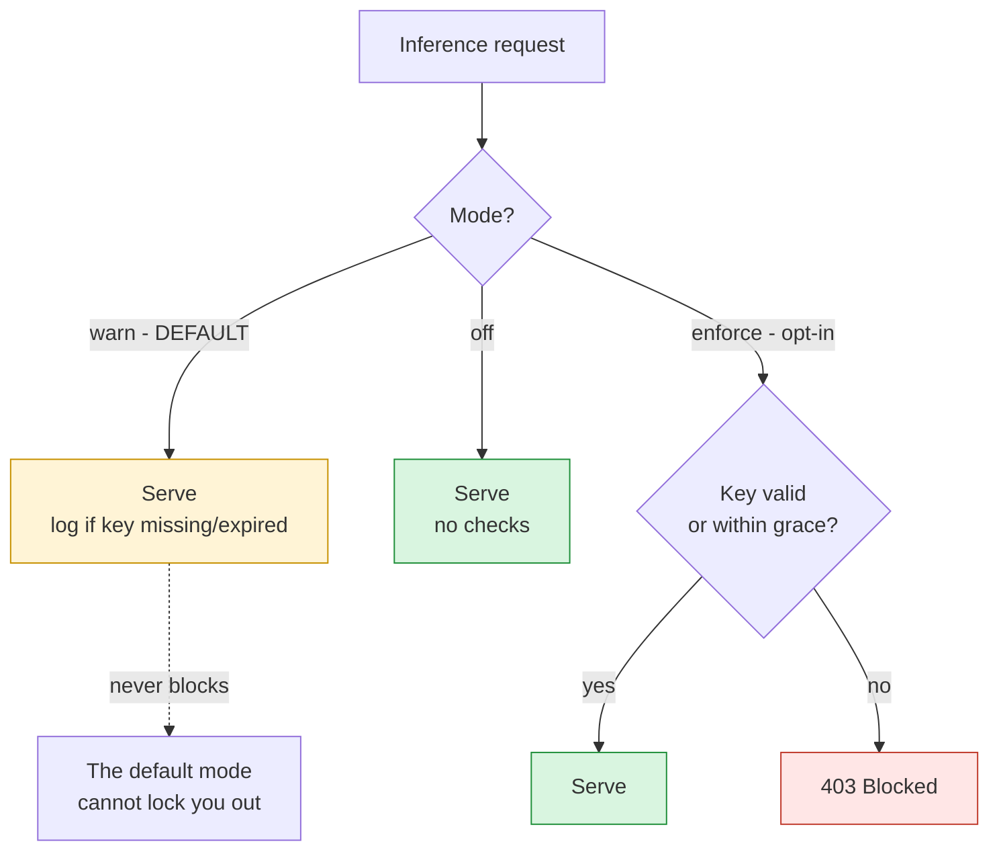
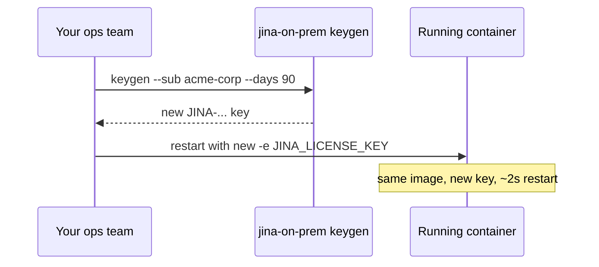

Two different things are called a "license" here, and keeping them apart avoids most of the confusion:

- **The commercial license** is the contract that grants the right to run a CC-BY-NC-4.0 model in production. It comes from [Elastic sales](https://www.elastic.co/contact), and it is what actually governs your usage.
- **The license key** on this page is an optional technical convenience: a small, offline, expiring token you can pass to a deployment so that ops and audit can see "this instance carries an entitlement that expires on date X".

The rest of this page is about the second one. Nothing here changes the first.

**The key can never take your deployment offline.** By default it only reports; you have to explicitly ask for anything that blocks. If you read one line on this page, that is it.

## Contents

- [What the key is](#what-the-key-is)
- [The default never blocks](#the-default-never-blocks)
- [The three modes](#the-three-modes)
- [Issue and deploy a key](#issue-and-deploy-a-key)
- [Renewing a key](#renewing-a-key)
- [What it can and cannot do](#what-it-can-and-cannot-do)
- [For a security review](#for-a-security-review)
- [Environment variables](#environment-variables)
- [FAQ](#faq)

## What the key is

- A single-line, copy-paste token, e.g. `JINA-eyJ...`.
- **Time-bound** — the expiry date is inside the token.
- **Fully offline** — the server checks it locally with an HMAC signature comparison. No license server, no internet, no phone-home. That is what makes it usable in a disconnected network.
- **Runtime-injected** — you pass it with `-e JINA_LICENSE_KEY=...` at `docker run`. Issuing or renewing a key never rebuilds the image.

You mint your own keys with the CLI in this repo, so nothing about the key requires contacting us.

What it is not: it is not DRM, not a kill switch, and not the thing that grants usage rights. Those distinctions matter for a security review and are spelled out in [What it can and cannot do](#what-it-can-and-cannot-do).

## The default never blocks

The design's first constraint, above every feature:

> **A running deployment must never be blocked by the license key** — not by a missing key, an expired key, a corrupted key, or a wrong system clock.

Out of the box, with no configuration, the server treats the key as an advisory signal: it always answers requests, and a missing or expired key produces a log line and a field in `/health`. Blocking is strictly opt-in, and it exists for time-boxed trials you *want* to lapse.



A production deployment can run in the default mode with no key at all, indefinitely, and nothing breaks. The key is there so that when an auditor asks to see an entitlement with an expiry, you can point at `/health`.

## The three modes

Set with `JINA_LICENSE_MODE`.

| Mode | Behaviour | Blocks on a bad or missing key? | Use it for |
|---|---|---|---|
| **`warn`** (default) | Fail-open. Always serves. Logs and reports key state in `/health`. | **Never** | Production. This is the safe default. |
| **`enforce`** | Fail-closed. Returns HTTP 403 on inference endpoints when the key is missing, expired past grace, or invalid. | Yes, after grace | A time-boxed trial or POC you want to lapse on a date. |
| **`off`** | No checking, no logging. | Never | Making the feature completely invisible. |

Even in `enforce` there is a **grace window** (default 14 days, `JINA_LICENSE_GRACE_DAYS`): an expired key keeps working while logging loudly, so clock skew or a slow renewal never causes a hard cutoff on a day boundary. Set it to `0` for a strict cutoff at expiry.

## Issue and deploy a key

**1. Mint a key.** Any machine with this repo; no Docker and no network needed:

```bash
python jina-on-prem.py keygen --sub "acme-corp" --days 90
```

```
License key minted
  Licensed to: acme-corp
  Model scope: *
  Valid days:  90
  Expires:     2026-10-04 22:00:00Z

JINA-eyJleHAiOjE3OTE...   <- this is the key
```

| Flag | Meaning | Default |
|---|---|---|
| `--sub` | Who the key is issued to, shown in `/health` and logs | required |
| `--days` | Validity window in days | 30 |
| `--category` | Restrict the key to one license category: `text`, `multimodal`, `reranker`, `reader`. Covers every model the image's catalog assigns to it, including ones added later. | unset |
| `--model` | Restrict the key to one exact model id. Mutually exclusive with `--category`. | `*` (any) |
| `--secret` | Sign with a custom secret, matching the server's `JINA_LICENSE_SECRET` | public default |
| `--json` | Emit key and claims as JSON | off |

**2. Deploy with it.** Default mode, which never blocks:

```bash
docker run -e JINA_LICENSE_KEY="JINA-eyJleHAiOjE3OTE..." \
  -p 8080:8080 jina/jina-embeddings-v5-text-nano:cpu
```

**3. Verify.** `/health` needs no key to read:

```bash
curl -s http://localhost:8080/health | python3 -m json.tool
```

```json
{
  "status": "ok",
  "model": "jina-embeddings-v5-text-nano",
  "category": "text",
  "license": {
    "mode": "warn",
    "valid": true,
    "fail_open": true,
    "licensed_to": "acme-corp",
    "model": "*",
    "expires": "2026-10-04T22:00:00Z",
    "days_left": 89.9
  }
}
```

That `license` block is what you show an auditor: a concrete, expiring, machine-checkable entitlement, produced entirely offline.

The top-level `model` and `category` say what this image *is*: the model it runs, and the license category that model is sold under. The `license` block says what your key *covers*, so a key scoped with `--category` shows a `category` there instead of a `model`. Reading the two together answers "is this deployment inside what we bought?" without decoding anything, and if the two categories disagree the key does not cover this image, with `reason` saying `model_not_licensed`.

The top-level `category` is present even with no key set at all, so it is also how you check which category an image needs before buying anything.

**Optional — a trial with a real expiry**, for a POC you want to lapse:

```bash
docker run -e JINA_LICENSE_KEY="JINA-..." \
  -e JINA_LICENSE_MODE=enforce \
  -p 8080:8080 jina/jina-embeddings-v5-text-nano:cpu
```

## Renewing a key

Renewal never touches the image:



1. `python jina-on-prem.py keygen --sub "acme-corp" --days 90`
2. Restart the container with the new `JINA_LICENSE_KEY`.

No `docker build`, no re-transfer of the multi-GB bundle, and no downtime beyond a container restart — or none at all with the blue/green pattern in [Versioning & Updates](Versioning-And-Updates).

## What it can and cannot do

| Capability | Supported? | Notes |
|---|---|---|
| Show an entitlement that expires on a date | Yes | Visible in `/health` and logs |
| Work fully offline | Yes | Local HMAC check, no network |
| Issue or renew without rebuilding the image | Yes | Runtime env var |
| Restrict a key to a specific model | Yes | `keygen --model <id>` |
| Restrict a key to a license category | Yes | `keygen --category <name>`, covering the models the catalog assigns to it |
| Never block a running deployment | Yes | The default `warn` mode is fail-open |
| Optionally block after expiry | Yes | `enforce` mode plus grace window |
| Resist a determined user | **No** | The signing secret ships in the image, so a key can be minted or the check disabled. See below. |
| Cryptographically prove entitlement | **No** | Would require asymmetric signing and key custody |
| Meter usage, count tokens, or bill | **No** | Out of scope; this is an expiry signal, not a meter |
| Phone home or report usage | **No** | Never — it would break the offline guarantee |

## For a security review

The mechanism, stated plainly, because a reviewer will ask:

- **The key is a signed token with an embedded expiry.** The payload is a small JSON object, base64url-encoded, followed by an **HMAC-SHA256** signature. Structurally the same as a signed JWT with an `exp` claim, which is the standard way to validate a license offline. The claims are `sub`, `iat`, `exp`, `v`, exactly one scope claim (`category` or `model`), and `order_product_id` on a key issued against a purchase.
- **Validation is a local comparison.** The server recomputes the HMAC with its secret, compares in constant time, then checks `exp` against the system clock and, if present, the scope. There is no network call on any path.
- **It is not tamper-proof, and should not be described as such.** The signing secret ships inside the image, so anyone with the image can mint a key or set `JINA_LICENSE_MODE=off`. This is a compliance and visibility feature, not an access control. Representing it as tamper-resistant in a questionnaire would be inaccurate.
- **Why not TOTP or an authenticator app?** TOTP generates rotating 30-second codes for interactive 2FA against a live verifier. There is no interactive login and no live verifier inside a disconnected deployment, so it is the wrong shape for a durable multi-month window. A signed token with an `exp` is the right one.
- **Fail-open is enforced in one place.** A single `decide()` function is the only authority on whether to serve. In `warn` and `off` it always allows; in `enforce` an expired key is allowed through the grace window. Validation is wrapped so that an unexpected error also fails open. No code path lets a default-configured server refuse a request because of the key.

## Environment variables

| Variable | Default | Purpose |
|---|---|---|
| `JINA_LICENSE_KEY` | (empty) | The key to present. Empty is fine in `warn` and `off`. |
| `JINA_LICENSE_MODE` | `warn` | `warn` (fail-open, default), `enforce`, or `off`. |
| `JINA_LICENSE_GRACE_DAYS` | `14` | In `enforce` only: days an expired key still works. `0` for a hard cutoff. |
| `JINA_LICENSE_SECRET` | public constant | HMAC signing secret. Set it with `--build-arg LICENSE_SECRET=...` at bundle time and sign with a matching `keygen --secret`. Changing it later invalidates every key already signed with the old value, so it is a coordinated change across your images and keys rather than routine maintenance. |
| `JINA_LICENSE_ENFORCE` | (unset) | Older equivalent: `0` means `off`, `1` means `enforce`. Superseded by `JINA_LICENSE_MODE`. |

## FAQ

**Can turning this on take my deployment offline?**
No. In the default `warn` mode the server always serves; a missing or expired key only logs and shows in `/health`. Blocking happens only if you set `JINA_LICENSE_MODE=enforce`, and even then an expired key survives the grace window.

**My key expired and nobody noticed. What happened to the service?**
Nothing — it kept serving. In `warn` mode expiry is advisory. You will see a warning in the logs and `days_left` going negative in `/health`, which is the cue to renew, but inference never stopped.

**Do I need internet or a license server?**
Never. Validation is a local HMAC check, which is the whole point.

**Can the key be removed or the check bypassed?**
Yes, easily — the secret is in the image and `JINA_LICENSE_MODE=off` disables it. Treat it as a compliance and visibility feature, not a security control.

**Is the key what makes my usage licensed?**
No. Usage rights come from the commercial license via [Elastic sales](https://www.elastic.co/contact). The key is an operational signal that a deployment carries a time-bound entitlement; it neither grants nor revokes the underlying right.

**How do I restrict a key to one model?**
`python jina-on-prem.py keygen --sub acme --days 90 --model jina-embeddings-v5-text-nano`. A request for a different model returns `model_not_licensed` in `enforce` mode, and is logged only in `warn`.

## Next

- [Product & Model Lifecycle (EOL)](Product-And-Model-Lifecycle) - how long a model is maintained, and why weights never expire
- [Versioning & Updates](Versioning-And-Updates) - zero-downtime restart pattern for a key rotation
- [API Reference](API-Reference) - the endpoints the check sits in front of
- [FAQ](FAQ) - broader business and licensing questions
