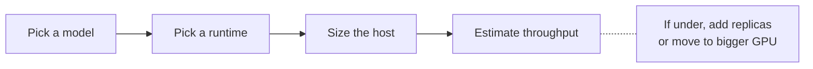

Capacity planning for jina-on-prem deployments. Covers GPU vs CPU choice, VRAM by model, expected throughput, disk, and redundancy.

## The three knobs



## Runtime: GPU or CPU?

| | CPU image (`:cpu` tag) | GPU image (`:gpu` tag) |
|---|---|---|
| Base | `python:3.11-slim` | `pytorch/pytorch:2.5.1-cuda12.1-cudnn9-devel` |
| Image size | 2-4 GB | 8-12 GB |
| Needs GPU on host | no | yes (CUDA 12.1+, driver 525+) |
| Latency, single request | 200-2000 ms | 10-200 ms |
| Throughput, batched | ~5-20 docs/s | 100-1000 docs/s |
| Cost on GCP (1 month, on-demand) | ~$50 (e2-standard-4) | ~$500 (g2-standard-4 + L4) |

**Rule of thumb**: < 10 QPS sustained -> CPU is fine and a lot cheaper. > 10 QPS or latency-sensitive interactive use -> GPU.

## Per-model VRAM and recommended GPU

| Model | Min VRAM | Recommended GPU | Notes |
|---|---|---|---|
| jina-embeddings-v5-text-nano | 2 GB | T4 / L4 | CPU also fine |
| jina-embeddings-v5-text-small | 3 GB | L4 / A10G | T4 OK with smaller batches |
| jina-embeddings-v5-omni-small | 8 GB | L4 / A10G / A100 | multimodal |
| jina-embeddings-v4 | 10 GB | A10G / A100 | multimodal, 32K |
| jina-reranker-v3.5 | 3 GB | L4 | 131K context |
| jina-reranker-v3 | 3 GB | L4 | 131K context |
| jina-clip-v2 | 4 GB | L4 | text + image |
| jina-code-embeddings-1.5b | 4 GB | L4 | |
| ReaderLM-v2 | 4 GB | L4 | 512K context, plan for bigger batches |

Full per-model VRAM in the [Model Catalog](Model-Catalog).

> **L4 is the workhorse**. 24GB, sane price, available in most regions, handles any model except v4-multimodal. Default to it unless A100 latency is required or L4 is unavailable in the target region (see [Troubleshooting -> L4 stockout](Troubleshooting#l4-stockout)).

## Reranker host memory

The listwise rerankers (`jina-reranker-v3`, `jina-reranker-v3.5`) score a block of
documents in one forward pass instead of one document at a time, so the memory a
single request needs grows with the **square** of the tokens in that request, not
linearly with the document count. Size the host from the largest request you
intend to send, not from the average.

On GPU this is not a practical constraint at L4 size: the full 16-document mixed
corpus below (~29K tokens, longest document 90,000 characters) completes in 8.4 s
using 8.7 GB of the L4's 23 GB.

On the `:cpu` image, host RAM is the binding constraint. Measured with
`jina-reranker-v3.5:cpu` on a `g2-standard-8` (8 vCPU, 31 GB RAM), uniform
2000-character English documents, one request at a time:

| Documents per request | Total characters | Result |
|---|---|---|
| 8 | 16,000 | 34 s |
| 12 | 24,000 | 67 s |
| 16 | 32,000 | 108 s |
| 24 | 48,000 | exceeds 31 GB; the host OOM-kills the container (exit 137) |

Two ways to stay inside a RAM budget: cap documents per request at the client and
page through the candidate list, or give the host more RAM. On the same 31 GB host,
`jina-reranker-v3:cpu` completed the mixed corpus that `jina-reranker-v3.5:cpu`
could not, so it is the safer pick where RAM is fixed and small.

These are the model's own batching defaults, not a jina-on-prem setting - there is
no knob in the container to change them.

## Disk planning


- **Builder machine**: 100 GB minimum if bundling 1-2 models. Each build holds: built image (2-12 GB) + tar.gz (1-7 GB) + Docker BuildKit cache (up to 20 GB). Bundling the whole catalog needs a different order of magnitude — the 74 published images total 509 GB.
- **Target host**: needs ~2x the image size at runtime (image + Docker layer cache). For a 4 GB image, plan 10 GB disk.
- **Reclaim**: `docker builder prune -af` between bundles. `docker system prune -f` after.

### Published image sizes

Compressed size of every published image — what you download, and close to what `docker save | gzip` produces for offline transport. On disk after `docker pull` or `docker load` it expands, so size the target host off `docker images`, not off this table.

`:gpu-opt` is the `:gpu` image with the batcher enabled, byte for byte the same size, so it is not listed separately.

| Model | cpu GB | gpu GB | | Model | cpu GB | gpu GB |
|---|---|---|---|---|---|---|
| `jina-embeddings-v5-text-nano` | 0.8 | 7.1 | | `jina-reranker-v3.5` | 1.2 | 7.5 |
| `jina-embeddings-v5-text-small` | 1.4 | 7.7 | | `jina-reranker-v3` | 1.3 | 7.8 |
| `jina-embeddings-v5-omni-nano` | 2.0 | 8.5 | | `jina-reranker-m0` | 3.9 | 10.2 |
| `jina-embeddings-v5-omni-small` | 3.0 | 9.5 | | `jina-reranker-v2-base-multilingual` | 3.2 | 9.5 |
| `jina-embeddings-v4` | 6.2 | 12.5 | | `jina-reranker-v1-base-en` | 0.7 | 7.0 |
| `jina-embeddings-v3` | 3.8 | 10.1 | | `jina-reranker-v1-turbo-en` | 0.8 | 7.1 |
| `jina-clip-v2` | 13.8 | 20.1 | | `jina-reranker-v1-tiny-en` | 0.7 | 7.0 |
| `jina-clip-v1` | 3.8 | 10.1 | | `jina-colbert-v2` | 2.2 | 12.4 |
| `jina-code-embeddings-1.5b` | 2.6 | 9.0 | | `jina-colbert-v1-en` | 1.0 | 11.1 |
| `jina-code-embeddings-0.5b` | 1.1 | 7.4 | | `ReaderLM-v2` | 13.3 | 19.8 |
| `jina-embeddings-v2-base-en` | 1.8 | 8.1 | | `reader-lm-1.5b` | 2.6 | 9.2 |
| `jina-embeddings-v2-base-de` | 1.7 | 8.0 | | `reader-lm-0.5b` | 1.1 | 7.6 |
| `jina-embeddings-v2-base-es` | 1.4 | 7.7 | | `jina-vlm` | 4.5 | 10.8 |
| `jina-embeddings-v2-base-zh` | 1.7 | 8.0 | | | | |
| `jina-embeddings-v2-base-code` | 1.7 | 8.0 | | | | |
| `jina-embedding-b-en-v1` | 0.8 | 7.1 | | | | |

Two things to notice before planning disk or a USB transfer. The smallest GPU image is 7.0 GB against 0.7 GB for the same model on CPU, because a GPU image carries the CUDA runtime — call it 6 GB of fixed cost on every GPU row, which is why picking a smaller model saves far less on GPU than on CPU. And `jina-clip-v2` and `ReaderLM-v2` are the outliers at 13-14 GB even on CPU; every other CPU image fits in 6.2 GB.

## Ask for `base64` embeddings

Before any hardware decision, check how your client asks for its vectors. A 768-dimension embedding comes back either as 768 JSON numbers or as one base64 string, and at 128 inputs per request that is 98,304 floats to render into text. On bulk requests the rendering costs more than the inference.

Same server, same image, same GPU, same inputs — only the requested `encoding_format`:

| shape (concurrency x inputs) | float tok/s | base64 tok/s | ratio |
|---|---|---|---|
| 1 x 1 | 603 | 616 | 1.02 |
| 8 x 1 | 2,152 | 2,128 | 0.99 |
| 32 x 1 | 4,657 | 5,834 | 1.25 |
| 64 x 1 | 4,266 | 5,265 | 1.23 |
| 8 x 32 | 11,649 | **27,536** | **2.36** |
| 4 x 128 | 12,358 | **32,118** | **2.60** |

`jina-embeddings-v5-text-nano` on one L4, 4 rounds per cell, end to end over HTTP. The first two rows are inside run-to-run noise; the bulk rows are the result.

The GPU did identical work in both columns — batch rows per forward pass were unchanged, so the entire difference is serialisation. The vectors are the same numbers: decode the base64 back to float32 and it matches the float response element for element, not approximately.

The OpenAI SDK requests base64 by default, so a client built on it already gets this. Raw HTTP clients have to ask:

```bash
curl -s http://localhost:8080/v1/embeddings \
  -H 'Content-Type: application/json' \
  -d '{"input": ["..."], "encoding_format": "base64"}'
```

## Throughput math

Rough throughput on a single L4, batch size 32, measured through `SentenceTransformer.encode()` rather than over HTTP — so it excludes the serialisation cost above and reads high against a float-encoded API call:

| Model | Tokens/s | Documents/s (avg 50 tokens) |
|---|---|---|
| v5-text-nano | ~30,000 | ~600 |
| v5-text-small | ~12,000 | ~240 |
| v5-omni-small (text only) | ~6,000 | ~120 |

(Starting estimates from `scripts/benchmark.py`. Measure on your own hardware.)

The listwise rerankers are not covered by `scripts/benchmark.py` - it drives
`SentenceTransformer.encode()`, and they are not SentenceTransformer models.
Measured instead through `POST /v1/rerank` on the `:gpu` images, one L4, batch of
32 documents per request, warmed, median of a 30 s steady-state run:

| Model | 50-token documents | 500-token documents |
|---|---|---|
| reranker-v3 | 229 doc-query pairs/s | 21 doc-query pairs/s |
| reranker-v3.5 | 193 doc-query pairs/s | 12 doc-query pairs/s |

Reranker throughput falls off sharply with document length because the whole
batch goes through one forward pass. Budget by total tokens per request, not by
document count.

For higher throughput:
1. **Ask for `base64`**, as above. Free, and the largest single factor on bulk requests.
2. **Batch at the client.** Send 32-256 inputs per request, not one at a time.
3. **Use matryoshka** to truncate output dims at query time if the index dim doesn't need to be full size.
4. **Multiple replicas.** A 4-vCPU + 1xL4 host can run one container. Two hosts -> 2x. Load balance with anything (nginx, HAProxy, ALB).
5. **Bigger GPU.** A10G is ~2x L4, A100 ~4x for these models.

## GPU dynamic batching — the `:gpu-opt` images

A `:gpu` container runs one forward pass at a time, so if your clients each send one input and there are many of them, they queue. The `:gpu-opt` tag is the same image with a server-side batcher enabled: one GPU worker collects whatever requests are in flight, sorts them by length, packs them into a token-budgeted batch and runs them together. Published for the 16 embedding models; rerankers, ColBERT, reader and VLM images come as `:cpu` and `:gpu` only.

**Which one to run**, from measuring both on the same GPU across all 16 models:

| Your traffic | Choose | Why |
|---|---|---|
| Many clients, one or a few inputs per request | `:gpu-opt` | The batcher does the batching your clients are not doing. Latency improves too, because a request waits behind a batch instead of behind a queue. |
| Few clients, 32-256 inputs per request | `:gpu` | No gain to collect — the client already batches. Across the 16 models the median difference at these shapes was 0.98x at 8x32 and 0.93x at 4x128, and the worst case was 0.58x. |
| Mixed, or you are not sure | `:gpu-opt` | It is never much worse on bulk traffic and much better on concurrent traffic. Check against your own shape. |

We are not publishing a throughput multiplier for the concurrent case. The gains we measure there are large, but at high concurrency with single-input requests our load generator becomes the limiting factor rather than the server, so the number would describe our test harness as much as the product. Measure it on your own traffic shape.

**The two images return the same vectors.** Same corpus, same GPU, one image after the other:

| Model | min cosine | max per-dimension delta |
|---|---|---|
| `jina-embeddings-v5-text-nano`, `-text-small`, `-omni-nano`, `-omni-small` | 1.0 | 0 |
| `jina-embeddings-v3`, `jina-embeddings-v4`, `jina-clip-v1`, `jina-clip-v2` | 1.0 | 0 |
| `jina-embeddings-v2-base-en` | 0.99999983 | 7.3e-05 |
| `jina-embeddings-v2-base-es` | 0.99999981 | 7.1e-05 |
| `jina-embeddings-v2-base-code` | 0.99999976 | 8.8e-05 |
| `jina-embedding-b-en-v1` | 0.99999919 | 1.9e-04 |
| `jina-embeddings-v2-base-de` | 0.99999907 | 2.4e-04 |
| `jina-code-embeddings-0.5b` | 0.99999749 | 4.4e-04 |
| `jina-code-embeddings-1.5b` | 0.99999738 | 7.4e-04 |
| `jina-embeddings-v2-base-zh` | 0.99989038 | 1.6e-03 |

Eight of the sixteen are identical to the last bit. The rest differ only where a different batch composition changes floating-point summation order, which is normal for any batching inference server and is far below the scale that affects retrieval ranking.

To check this on your own hardware, embed the same inputs against both images and compare — no special tooling needed, since both accept the identical request.

Tuning, if the defaults do not fit: `JINA_BATCH_TOKENS` (token budget per batch), `JINA_BATCH_WAIT_MS` (how long the worker waits for more requests before running), `JINA_DTYPE`. The defaults are set for an L4.

## Deployment topologies

Where the jina-on-prem container sits in a typical architecture:

```
  outside  │   your perimeter (firewall / VPN / ZTNA)
  ─────────┼────────────────────────────────────────────────────
           │
   user  ──┼──► ingress ──► app ──► jina-on-prem   ─►  ╳ internet
           │                   │     :8080              (blocked)
           │                   │
           │                   └──► Elasticsearch
           │                          └ (optional inference call)
           │                            back into jina-on-prem
```

Three common placements:

- **Sidecar to the app**: jina-on-prem and the calling app on the same VM/pod. Lowest latency (localhost). Best when the app needs many embedding calls per request.
- **Shared service**: one jina-on-prem host serving multiple apps via internal DNS. Easier to right-size; one place to patch.
- **Behind Elasticsearch**: ES inference service calls jina-on-prem at indexing and query time. Apps talk only to ES. Cleanest for search-only stacks.

## Redundancy

Three patterns:

```
  single host           active-active             k8s
  ──────────            ─────────────             ───
                                                  ┌──► pod A
  client ─► jina       client ─► LB ─► host A     │
                                  │     host B    LB ──► pod B
                                  └──► host B     │
                                                  └──► pod N
```

- **Single host** is fine for POC, dev, internal tools. No redundancy.
- **Active-active** with two hosts behind any L4 load balancer. Models are stateless so any request can go to any replica. Use this for production. Maintain spare image tarballs on disk so you can rebuild a host without rebundling.
- **Kubernetes** if you already run it. Each pod is `docker run` with a `Service` and `Deployment`. Persistent volume not needed (model is in the image). NodeSelector for GPU nodes if you mix GPU and CPU.

A ready-to-apply manifest with Namespace + Deployment + Service + HPA + Ingress lives at [`k8s/jina-on-prem.yaml`](https://github.com/jina-ai/jina-on-prem/blob/main/k8s/jina-on-prem.yaml):

```bash
# Load the image on every node (no internal registry needed):
for n in node-1 node-2 node-3; do
  docker save jina/jina-embeddings-v5-text-small:gpu | ssh $n "docker load"
done

kubectl apply -f k8s/jina-on-prem.yaml
kubectl -n jina-on-prem rollout status deployment/jina-embed
kubectl -n jina-on-prem port-forward svc/jina-embed 8080:8080
curl http://localhost:8080/health
```

The manifest includes:

- `Deployment` with 2 replicas, rolling update strategy, GPU `nodeSelector`
- `Service` (ClusterIP) on port 8080
- `HorizontalPodAutoscaler` that scales 2-8 pods based on CPU
- `Ingress` example for nginx-ingress (comment out if not using)
- Readiness probe (30s initial, 60s grace) + liveness probe (90s initial)

To run two models (embed + rerank), copy the Deployment+Service blocks with different names and images.

## Prerequisites checklist

Before deploying or transferring a bundle:

- [ ] Host with Docker 24+ installed
- [ ] (GPU) NVIDIA driver >= 525, CUDA Container Toolkit installed (`nvidia-smi` works in container)
- [ ] Disk: 2-3x the bundle size free
- [ ] Port 8080 (or chosen port) free
- [ ] Network plan: how does the calling app reach this host? localhost / LAN IP / internal DNS?
- [ ] (Optional) Load balancer in front if multi-replica

If this is not already configured, `scripts/bootstrap-gcp.sh` is a template — adapt it for your cloud or on-prem environment.

## Next

- [Bundling Guide](Bundling-Guide) - how to actually build the .tar.gz
- [Quick Start](Quick-Start) - first-deploy walkthrough
- [Troubleshooting](Troubleshooting) - VRAM OOM, CUDA mismatch, etc
