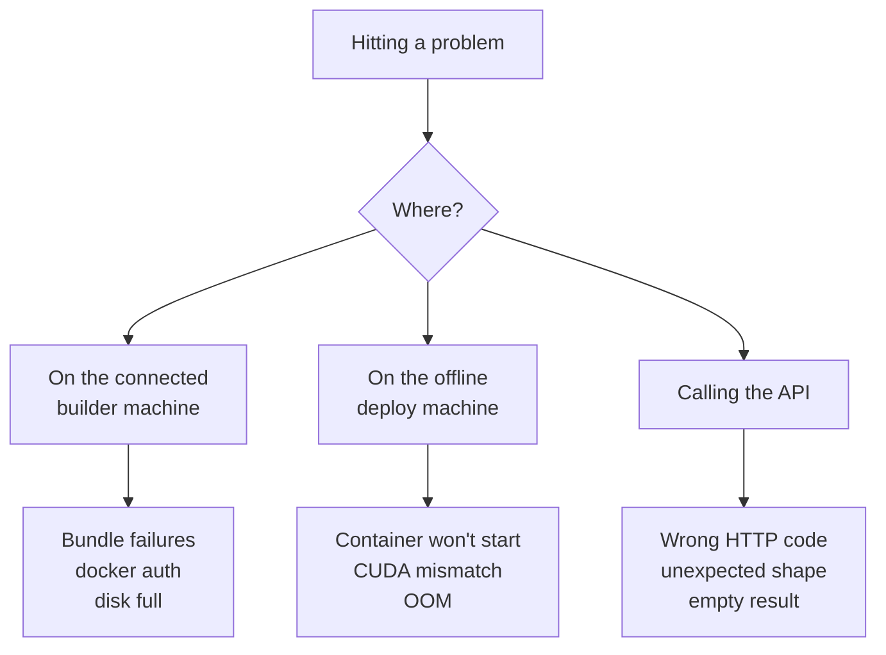

If you hit something not listed here, [Support](Support) covers where to report it and what to include - including what not to put in a public tracker.



Jump to a section: [Docker / install](#docker-permission-denied) - [L4 stockout](#l4-stockout) - [CUDA mismatch](#cuda-mismatch) - [OOM](#out-of-memory-on-gpu) - [Transformers version pins](#transformers-version-pins) - [GHCR auth](#prebuilt-pull-unauthorized) - [Wrong endpoint](#wrong-endpoint-returns-500) - [Verifying the air gap](#verifying-the-air-gap) - [Disk full](#disk-full-during-multi-model-build) - [Flash-attn build](#bundle-build-fails-on-flash-attn-compile) - [Reranker NaN](#empty--nan-embeddings-on-qwen3-reranker)

## Docker permission denied

**Symptom**

```
permission denied while trying to connect to the docker API at unix:///var/run/docker.sock
```

or from the CLI:

```
Error: Docker is not installed or not running.
```

**Cause**: your user isn't in the `docker` group, or the group membership hasn't been applied to your current shell session.

**Fix**:

```bash
sudo usermod -aG docker $USER
# then either reconnect SSH / open a new terminal, OR:
sg docker -c 'docker ps'        # apply group in current session
# OR prefix one-off commands with sudo:
sudo docker ps
```

## L4 stockout

**Symptom** (from `gcloud compute instances create`):

```
The zone 'projects/PROJECT/zones/ZONE' does not have enough resources to fulfill the request.
'NULL:0/NULL:0/NULL:0 (state:STOCKOUT, sub-state:STOCKOUT, resource type:compute)'
```

**Cause**: L4 GPUs are heavily oversubscribed, and several US zones are commonly out at the same time.

**Fix**: retry in another zone, or fall back to another GPU type with quota in a zone you can get. A retry loop is at the bottom of [`scripts/bootstrap-gcp.sh`](https://github.com/jina-ai/jina-on-prem/blob/main/scripts/bootstrap-gcp.sh).

No GPU is needed to build an image, including a GPU image, so a CPU-only instance avoids this entirely.

## Prebuilt pull unauthorized

**Symptom**:

```
Error response from daemon: error from registry: unauthorized
```

**Cause**: published images pull anonymously, so this is not a credentials problem — nothing is published at the name you asked for. Either the model has no prebuilt image, or the runtime tag does not exist for it (`gpu-opt` is published for the embedding models only).

**Fix**: check the Prebuilt column of the [Model Catalog](Model-Catalog) for that model, and bundle it yourself if there is none:

```bash
python jina-on-prem.py bundle --model MODEL
```

The catalog ids are not all lowercase but registry names must be, so pull `readerlm-v2`, not `ReaderLM-v2`. [`scripts/pull-prebuilt.sh`](https://github.com/jina-ai/jina-on-prem/blob/main/scripts/pull-prebuilt.sh) and `jina-on-prem.py` handle the case for you.

## No matching manifest on Apple Silicon

**Symptom**:

```
Error response from daemon: no matching manifest for linux/arm64/v8 in the manifest list entries: no match for platform in manifest: not found
```

**Cause**: prebuilt images are published for `linux/amd64` only. On an arm64 daemon (Apple Silicon Mac, arm servers) Docker looks for an arm64 entry in the manifest list, finds none, and refuses rather than picking a foreign architecture on your behalf.

**Fix**: name the platform. Docker then takes the amd64 image and runs it under emulation (Rosetta on macOS):

```bash
docker pull --platform linux/amd64 ghcr.io/jina-ai/jina-on-prem/jina-embeddings-v5-text-nano:cpu
docker run --platform linux/amd64 -p 8080:8080 ghcr.io/jina-ai/jina-on-prem/jina-embeddings-v5-text-nano:cpu
```

The flag is needed on both commands: `pull` chooses which image to fetch, `run` tells the daemon to emulate it. [`scripts/pull-prebuilt.sh`](https://github.com/jina-ai/jina-on-prem/blob/main/scripts/pull-prebuilt.sh) handles this for you. It pulls without naming a platform first, so you get a native image whenever one exists, and only falls back to `linux/amd64` when the registry has nothing for your architecture.

Emulated output is correct but the throughput is a fraction of native, so treat this as a way to try the API, not to measure it. To develop against the API on a Mac, skip Docker and run the server directly: `python jina-on-prem.py serve --model jinaai/jina-embeddings-v5-text-nano` uses native arm64 PyTorch.

## CUDA mismatch

**Symptom**: GPU container exits immediately with `CUDA error: no kernel image is available for execution on the device` or `forward compatibility was attempted on non supported HW`.

**Cause**: host's NVIDIA driver is older than what the image was compiled against. GPU image targets CUDA 12.1; you need driver `>=525.60`.

**Fix**:

```bash
nvidia-smi   # check the Driver Version line, NOT the CUDA version line
```

If `<525`, either update the driver or use the CPU image (`:cpu` tag) which has no CUDA dependency.

## Out of memory on GPU

**Symptom**: `CUDA out of memory. Tried to allocate XX MiB`.

**Cause**: model is too big for the GPU's VRAM, or another container is already using it.

**Fix**: check VRAM with `nvidia-smi`. The [Model Catalog](Model-Catalog) lists per-model VRAM. If you have 24 GB and the model says ~8 GB, you should fit two replicas but not four. Reduce batch size at the client (smaller `input` arrays) or pick a smaller model. See [Sizing & Hardware](Sizing-And-Hardware).

## Transformers version pins

**Symptom**: `ImportError: cannot import name 'Qwen3Config' from 'transformers'` or similar `cannot import` errors, only when running `serve` directly (not via Docker).

**Cause**: model needs a specific transformers version. Each model's `deps` block in `models/catalog.json` pins it; the Docker image installs exactly that. If you `serve` outside Docker you must mirror the pins.

**Fix**: read the pin out of the catalog, which is the same file the image was built from:

```bash
python jina-on-prem.py list --json | jq -r '.[] | "\(.id)\t\(.deps.transformers)"'
```

The pins span six transformers versions across the catalog and are exact on purpose: each model needs a config class or attention implementation from one specific release, and several of them fail on both older and newer ones. Two models pin `==4.57.0`, which is yanked on PyPI; an exact pin still installs a yanked release, which is why they pin the version rather than a range.

> The bundle phase deletes each model repo's own `requirements.txt` after download. This prevents runtime auto-upgrade by `trust_remote_code` paths that would otherwise call `pip install -r requirements.txt`.

## `OfflineModeIsEnabled` on a reranker

**Symptom**: `jina-reranker-v3.5` raises `huggingface_hub.errors.OfflineModeIsEnabled: Cannot reach https://huggingface.co/api/models/jinaai/jina-reranker-v3.5` while serving a rerank request, even though the container never needs the network.

**Cause**: transformers 4.57.3 sniffs base-mistral tokenizers by calling `huggingface_hub.model_info()` whenever a tokenizer is loaded by repo id instead of by path. The reranker's own `rerank()` re-loads its tokenizer by name, so the probe fires; in an air-gapped container it cannot complete.

**Fix**: none needed with the official images - the reranker pins `transformers==4.57.1`, which does not carry the probe. You reach this error by installing 4.57.3 yourself and running `serve` outside Docker; pin `==4.57.1` there too.

Only 4.57.3 is affected. Verified on `jina-reranker-v3.5`, loading by repo id with `HF_HUB_OFFLINE=1`:

| transformers | Without the bypass |
|---|---|
| 4.56.2 | works |
| 4.57.0 | works, but the release is yanked on PyPI |
| 4.57.1 | works |
| 4.57.2 | fails differently - `FileNotFoundError` from `os.listdir(<repo id>)` |
| 4.57.3 | fails - `OfflineModeIsEnabled` |

All working versions produce identical scores, so the pin is about offline behaviour, not quality.

## Wrong endpoint returns 500

**Symptom**: calling `/v1/embeddings` on a reranker container returns HTTP 500 (or vice versa).

**Cause**: reranker models can't serve embedding requests. They expose `/v1/rerank` only. The server doesn't currently return a helpful 400 for this case.

**Fix**: route the request to the right container. Embedding clients hit the embedding container; reranking clients hit the reranker container.

## Empty / NaN embeddings on Qwen3 reranker

**Symptom**: reranker scores are all 0.5 or all NaN.

**Cause**: Qwen3-based rerankers need `pad_token = eos_token`. The server sets this automatically. If you're loading the model with the SentenceTransformers SDK directly:

```python
model = CrossEncoder(...)  # NOT SentenceTransformer
model.tokenizer.pad_token = model.tokenizer.eos_token
```

## Verifying the air gap

**Symptom**: testing with `docker run --network none -p 8080:8080 ...` and the host can't reach `localhost:8080`.

**Cause**: `--network none` gives the container a network namespace with nothing in it but loopback — no interface, no address. There is nothing for `-p` to forward to, so the mapping never comes up.

**Fix**: reach the server over the container's own loopback instead of through a published port:

```bash
docker run --rm -d --name airgap-check --network none jina/MODEL:cpu
docker exec airgap-check python -c \
  "import urllib.request;print(urllib.request.urlopen('http://127.0.0.1:8080/health').read())"
```

This is how [`verify-offline.sh`](https://github.com/jina-ai/jina-on-prem/blob/main/verify-offline.sh) verifies an image, and it is the stronger test: `--network none` makes egress impossible at the kernel level, where `HF_HUB_OFFLINE=1` and `TRANSFORMERS_OFFLINE=1` only stop the code paths that honour them. The same script then proves the container cannot reach out, by checking that a socket to huggingface.co and to a raw IP both fail from inside.

Use `-p 8080:8080` for the deployment you actually run, and `--network none` plus `docker exec` when the question is whether it needs a network at all.

## Bundle build fails on `flash-attn` compile

**Symptom**: GPU bundle build hangs or OOMs during `pip install flash-attn`.

**Cause**: `flash-attn` requires `nvcc` (CUDA compiler), which isn't in the runtime-only base image. The Dockerfile uses the `-devel` variant of pytorch/pytorch which includes nvcc - if you've forked, make sure you're still on `pytorch/pytorch:2.5.1-cuda12.1-cudnn9-devel`.

## Disk full during multi-model build

**Symptom**: `no space left on device` after building two or three bundles.

**Cause**: each bundle leaves the BuildKit cache, the built image, and the `.tar.gz` - ~10-20 GB cumulative per model.

**Fix**:

```bash
docker builder prune -af       # reclaim BuildKit cache (safe)
docker image prune -f          # dangling intermediate images
rm jina-OLDMODEL-*.tar.gz      # tarballs already transferred
docker system df               # see what's left
```

## Got something else?

Please [file an issue](https://github.com/jina-ai/jina-on-prem/issues/new) with:

- `docker --version` and `nvidia-smi` if GPU
- The full command you ran
- `docker logs <container>` if a container started but failed
- Last 50 lines of bundle log if a build failed

Where to send it, and what not to put in a public tracker: [Support](Support).
